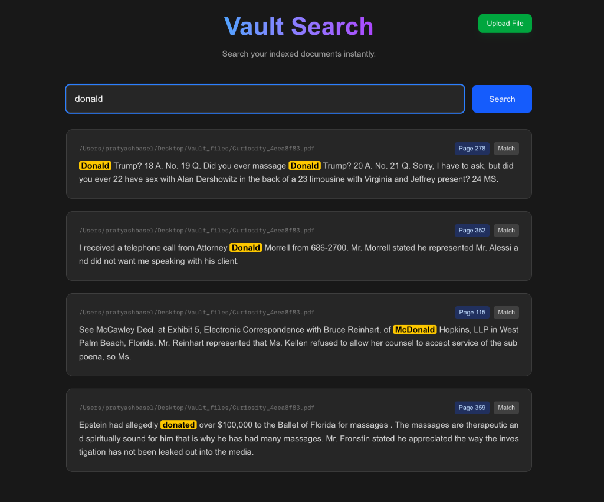

# Vault 🛡️

**Vault** is a high-performance, local document search engine designed to ingest, index, and instantly search through massive archives of documents (PDFs, Text, Zips) with page-level precision.

Built with **.NET 9**, **PostgreSQL**, **Elasticsearch**, and **Next.js**.



## 🚀 Use Cases

*   **Legal & Compliance**: Instantly find specific clauses or keywords across thousands of legal contracts.
*   **Personal Archives**: Index your entire hard drive of invoices, receipts, and notes.
*   **Research**: Aggregate research papers and find exact pages referencing specific topics.
*   **Developer Logs**: Ingest massive log archives (zipped) and search for error patterns.

## 🛠️ Tech Stack

*   **Backend**: .NET 9 (C#)
*   **Database**: PostgreSQL (Metadata & Storage) with EF Core
*   **Search Engine**: Elasticsearch (Vector-ready / Full-text Search)
*   **Ingestion**: Background Worker Service (`Vault.Tasks`) with `FileSystemWatcher`
*   **Text Extraction**: PdfPig (C# PDF Library)
*   **Frontend**: Next.js 15 (React 19) + TailwindCSS 4

## ✅ Implemented Features

- [x] **Core Architecture**
    - [x] Clean Architecture (Core, Db, Index, Tasks, API)
    - [x] Dockerized Dependencies (PostgreSQL, Elasticsearch, Kibana)
- [x] **Ingestion Pipeline**
    - [x] Real-time File Watching (`/tmp/vault_ingest`)
    - [x] **Recursive Zip Extraction**: Automatically unzips and processes archives.
    - [x] **PDF Text Extraction**: Extracts text content from PDFs.
    - [x] **Smart Filtering**: Ignores macOS ghost files (`__MACOSX`, `._files`).
- [x] **Search Intelligence**
    - [x] **Full-Text Search**: Fuzzy matching and keyword search.
    - [x] **Page-Aware Indexing**: Splits PDFs into individual pages so you know *exactly* which page a result is on.
    - [x] **Highlighting**: Returns HTML snippets with query terms highlighted (e.g., `<em class="bg-yellow-400">match</em>`).
- [x] **Frontend (UI/UX)**
    - [x] Modern Dark Mode Interface.
    - [x] **Deep Linking**: Clicking a result opens the PDF at the specific page (`#page=X`).
    - [x] Download API.

## 🚧 Pending Features

- [ ] **Pagination & Filtering**: Handle large result sets efficiently.
- [ ] **OCR Support**: Extract text from scanned images/PDFs.
- [ ] **Authentication**: Secure the index with user login.
- [ ] **Named Entity Recognition (NER)**: Auto-extract names, dates, and locations (Phase 4).

## 🏃‍♂️ Getting Started

### Prerequisites
*   Docker & Docker Compose
*   .NET 9 SDK
*   Node.js (v20+)

### 1. Start Services
```bash
cd Vault
docker-compose up -d
```

### 2. Run Backend (Worker & API)
```bash
# Terminal 1: Background Worker (Ingestion)
cd Vault/Vault.Tasks
dotnet run

# Terminal 2: API
cd Vault/Vault
dotnet run
```

### 3. Run Frontend
```bash
cd Vault/frontend
npm run dev
```

### 4. Usage
*   Drop a PDF or Zip file into `/tmp/vault_ingest`.
*   Watch the logs as it processes.
*   Go to `http://localhost:3000` and search!

---
*Built with Curiosity for JUST SOMETHING EASY (iykyk) by [Pratyaksh]*
